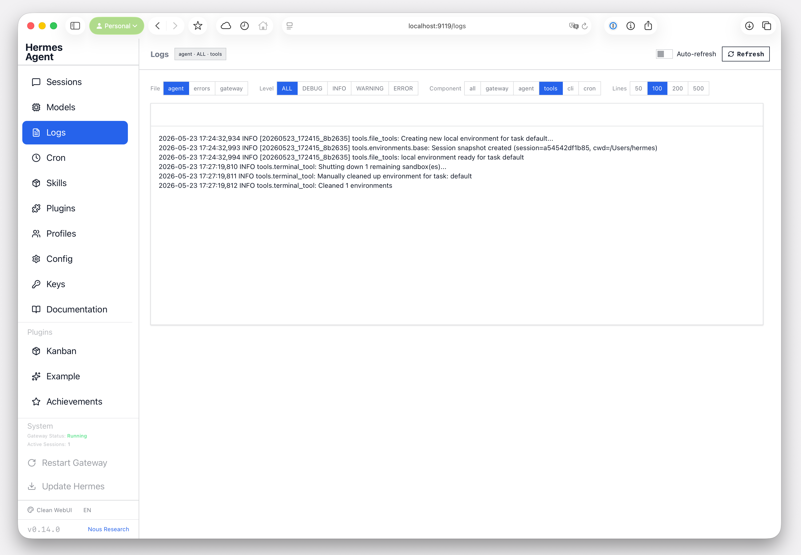

# Hermes Agent Dashboard Theme: Clean WebUI

Source: https://github.com/fplanque/hermes-agent-dashboard-theme-clean

1. Copy to ~/.hermes/dashboard-themes/clean-webui.yaml
2. Change ~/.hermes/config.yaml, lines 272-273
dashboard:
  theme: clean-webui

# Hermes Agent Dashboard Theme: Clean WebUI

Are the default themes that ship with Hermes' Dashboard too hard to read and use?

Here is a cleaned up version. 

## Installation

Just copy the file `clean-webui.yaml` to your `.hermes\dashboard-themes\` folder (create it if it's missing).

Then reload your dashboard in the browser and select the new theme in the bottom left.

## Customization

Just ask your agent to modify it.
